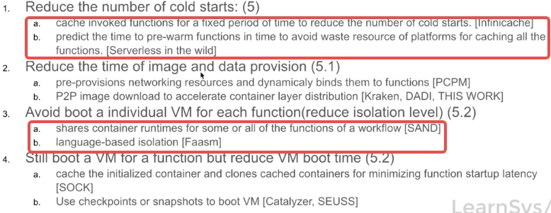

<!-- more -->

## Optimization chances of severless function start time[1][2][3]
 

## 参考 
**video**
[系统论文阅读研讨会week15：serverless & SAND](https://www.bilibili.com/video/BV1Hy4y1g7DQ/)

**Paper**
1. InfiniCache: Exploiting Ephemeral Serverless Functions to Build a Cost-Effective Memory Cache
2. Serverless in the Wild: Characterizing and Optimizing the Serverless Workload at a Large Cloud Provider
3. SAND: Towards High-Performance Serverless Computing

