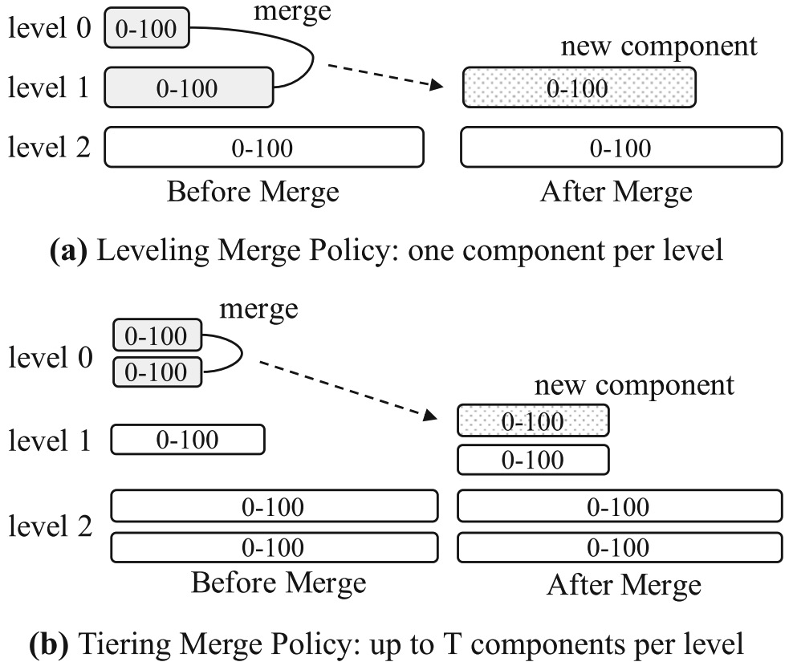
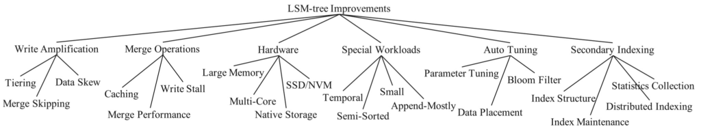

<!-- more -->

## LSM-tree basics
#####   LSM Tree基础
+ Merge有两个典型的策略：Leveling Merge Policy和 Tiering Merge Policy
 

Leveling Merge：每层维护一个component，层之间数据量比例为T。
Tiering Merge：每层维护最多T个component，满T个就整体合并成下一层的一个component。

##### 一些经典的优化手段
+ 优化一：Bloom filter
  [eg. Bloom filter in Hbase]
+ 优化二：Partitioning
  这样带来的好处很多：
  merge操作可以打散成多个小的merge操作。更精细的merge能够使merge的耗时和临时空间占用更加可控。
  对于顺序插入（每次都是插入更大的key，例如业务存储按时间排序类型的数据）和skewed update的情况，有可能大部分分区不需要merge，只需要merge少量的分区。
  注意到，partition优化和merge policy是**正交的**，但是**工业界基本上只有leveling merge policy用了partition优化**。
  [eg.  Minor Compaction in HBase]

## LSM-tree improvements
 

+ 降低写放大
  + tiering
  + Merge skipping
    [skip-list in HBase]
  + Expliointing data skew

## 参考
1. LSM-based storage techniques: a survey （VLDBJ 2020）
2. [LSMTree综述](http://loopjump.com/pr-lsmtree-survey/)